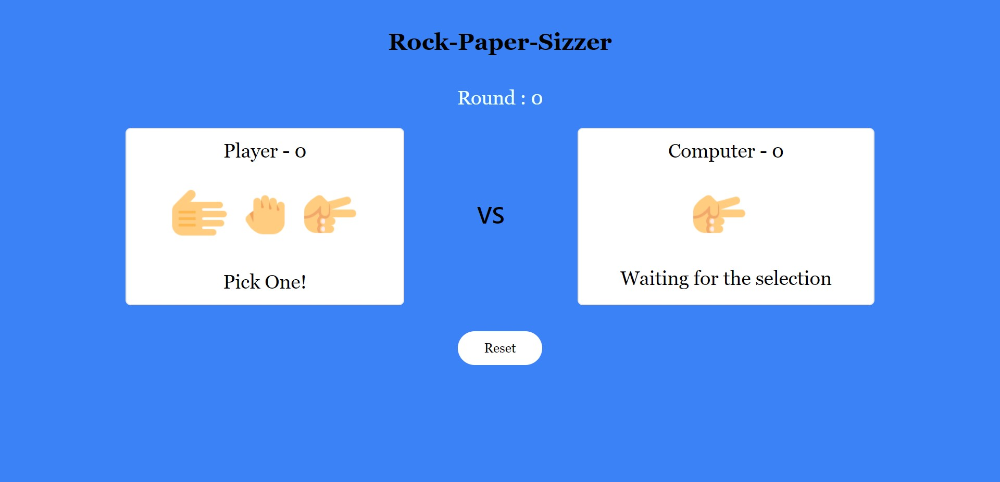

# Rock Paper Scissor Game

In the rock paper scissor game there is 1 player that play with computer.From rock,paper,scissor player need to select any one and if player won player will get point and if computer win then computer will get the points.Whoever will get 10 points first they will win the match.

## Deployment

To deploy this project run

Download the code from my repository and run the Index.html file in dist folder

## Features

1.User selects manually

2.PC select randomly

3.First to 10 round wins the game

4.Reset functionality

## Contribution

Any feature requests and pull requests are welcome!

